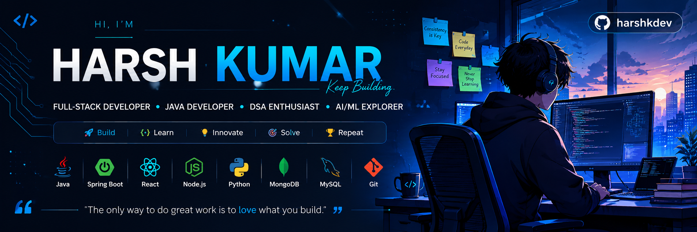

<div align="center">



# 👋 Hi, I'm Harsh Kumar

### 💻 Full-Stack Developer • Java Developer • DSA Enthusiast • AI/ML Explorer


<p align="center">

<a href="https://www.linkedin.com/in/harsh-kumar-860027397">

</a>

<a href="https://x.com/Mr_Harsh_005">

</a>

<a href="https://instagram.com/beiiing_harsh">

</a>

<a href="mailto:your.email@example.com">

</a>

</p>


</div>

---

# 🚀 About Me


- 🎓 **B.Tech CSE Student**
- 💻 **Full-Stack Developer** building with Java, Spring Boot, and React
- 📚 **DSA Enthusiast** — solving problems and sharpening fundamentals
- 🤖 **Exploring AI & Machine Learning**
- 🏆 **4+ Hackathons** participated • **5+ Real-World Projects** built
- 🌍 Passionate about solving real-world engineering problems with code
- 🌱 Currently deepening my skills in **Spring Boot, React & System Design**

<br clear="right"/>

# 💻 Tech Stack

<div align="center">

### 👨‍💻 Languages


### 🎨 Frontend


### ⚙️ Backend


### 🗄️ Database


### 🛠️ Tools


</div>

---

# 📊 GitHub Analytics

<div align="center">


<br>


</div>

---

# 📈 Contribution Graph

<div align="center">


</div>

---

# 🐍 Contribution Snake

<div align="center">


<!-- ⚠️ Note: this only renders if the snake-generation GitHub Action is set up
     in your harshkdev/harshkdev repo. Verify it's running, or remove this section. -->

</div>

---

# 💻 Coding Profiles

<div align="center">

<!-- 🔗 Replace these href values with your actual profile URLs -->

<a href="https://leetcode.com/u/YOUR_USERNAME/">

</a>

<a href="https://www.geeksforgeeks.org/user/YOUR_USERNAME/">

</a>

<a href="https://www.hackerrank.com/YOUR_USERNAME">

</a>

<a href="https://codeforces.com/profile/YOUR_USERNAME">

</a>

</div>

---

# 🚀 Featured Projects

<table>
<tr>

<td width="50%">

### ⚡ Underground Cable Fault Detection System
IoT-based system for detecting underground electrical cable faults without excavation.

**Tech Stack**
`IoT` `Arduino` `Sensors` `Embedded Systems`

**Highlights**
- 🔹 Detects underground cable faults
- 🔹 Reduces unnecessary digging
- 🔹 Real-time monitoring

🔗 [Repo](https://github.com/harshkdev/REPO_NAME) • 🚀 [Demo](#)

</td>

<td width="50%">

### 📡 Micro-Failure Early Warning System
AI-powered monitoring system that predicts equipment failures before they occur.

**Tech Stack**
`AI` `IoT` `Python`

**Highlights**
- 🔹 Predictive maintenance
- 🔹 Early warning alerts
- 🔹 Real-time sensor analysis

🔗 [Repo](https://github.com/harshkdev/REPO_NAME) • 🚀 [Demo](#)

</td>

</tr>

<tr>

<td width="50%">

### 🌱 Smart Agriculture & Irrigation System
An IoT solution for monitoring soil conditions and automating irrigation.

**Tech Stack**
`IoT` `Sensors` `Web Dashboard`

**Highlights**
- 🌾 Soil moisture monitoring
- 💧 Automatic irrigation
- 📊 Live dashboard

🔗 [Repo](https://github.com/harshkdev/REPO_NAME) • 🚀 [Demo](#)

</td>

<td width="50%">

### 🎭 AI Deepfake Detection System
AI-based system to identify manipulated images and videos.

**Tech Stack**
`Python` `TensorFlow` `OpenCV`

**Highlights**
- 🤖 Deepfake detection
- 🎥 Video analysis
- 📈 High accuracy prediction

🔗 [Repo](https://github.com/harshkdev/REPO_NAME) • 🚀 [Demo](#)

</td>

</tr>

<tr>

<td colspan="2">

### 🛰️ ISRO Hackathon Project — Route Resilience using AI & Satellite Imagery
An AI-powered pipeline that reconstructs hidden road networks from satellite imagery and converts them into graph structures for disaster response and infrastructure resilience analysis.

**Tech Stack**
`PyTorch` `OpenCV` `NetworkX` `Deep Learning`

🔗 [Repo](https://github.com/harshkdev/REPO_NAME) • 🚀 [Demo](#)

</td>

</tr>

</table>

---

# 📚 Currently Learning

```text
███████████████░░░░░░░░░░  Java DSA
████████████░░░░░░░░░░░░░  Spring Boot
███████████░░░░░░░░░░░░░░  React
██████████░░░░░░░░░░░░░░░  AI / ML
████████░░░░░░░░░░░░░░░░░  System Design
```

---

# 🌟 Goals for 2026

- 🎯 Crack a Software Engineering Internship
- 🎯 Master Java + Spring Boot
- 🎯 Solve 300+ DSA Problems
- 🎯 Contribute to Open Source
- 🎯 Build Production-Ready Full-Stack Applications
- 🎯 Strengthen AI/ML Skills

<!-- 💡 Tip: swap 🎯 → ✅ as you actually complete each goal -->

---

<div align="center">

## ⭐ If you like my work, consider giving my repositories a star!

### Thanks for visiting my profile ❤️


</div>
